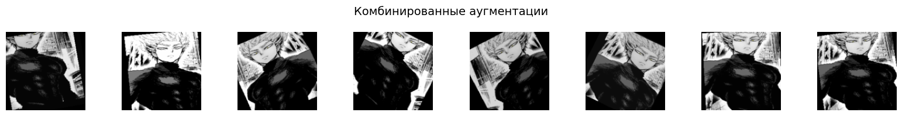
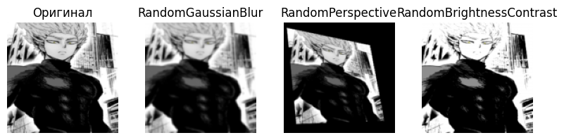
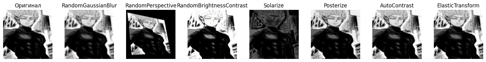
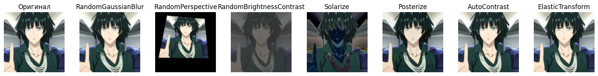

data и results на Гугл диске:
	
[https://drive.google.com/file/d/1blRq75kOd66QlVqzm4Natdyx5PZFGTjm/view?usp=sharing](https://drive.google.com/drive/folders/1cRNOMnbqGuw9pz7nDQxywLjXBwutQyUq?usp=sharing)

# Задание 1: Стандартные аугментации torchvision (15 баллов)

1) Создайте пайплайн стандартных аугментаций torchvision (например, RandomHorizontalFlip, RandomCrop, ColorJitter, RandomRotation, RandomGrayscale).
2) Примените аугментации к 5 изображениям из разных классов (папка train).
3) Визуализируйте:
    - Оригинал
    - Результат применения каждой аугментации отдельно
    - Результат применения всех аугментаций вместе

**Гароу**




**Генос**


**Сайтама**


**Соник**


**Татсумаки**


**Фубуки**


# Задание 2: Кастомные аугментации (20 баллов)

1) Реализуйте минимум 3 кастомные аугментации (например, случайное размытие, случайная перспектива, случайная яркость/контрастность).
2) Примените их к изображениям из train.
3) Сравните визуально с готовыми аугментациями из extra_augs.py.

К сожалению в extra_augs.py нет ни случайного размытия, ни случайной перспективы, ни случайной яркости/контрастности

**Гароу**





**Генос**


**Сайтама**


**Соник**


**Татсумаки**


**Фубуки**




# Задание 3: Анализ датасета (10 баллов)

1) Подсчитайте количество изображений в каждом классе.
```
Класс     Кол-во
Гароу       30
Сайтама     30
Соник       30
Татсумаки   30
Фубуки      30
```
2) Найдите минимальный, максимальный и средний размеры изображений.
```
Класс      Мин. размер      Макс. размер     Средний размер
Гароу       (246, 246)      (735,  889)     (538.43, 514.63)
Генос       (270, 363)      (720, 1070)     (550.17, 673.90)
Сайтама     (375, 366)      (736, 1308)     (559.33, 669.27)
Соник       (210, 240)      (604, 1076)     (525.87, 609.93)
Татсумаки   (267, 267)      (736, 1308)     (527.20, 635.83)
Фубуки      (286, 353)      (736, 1104)     (532.37, 637.77)
```
3) Визуализируйте распределение размеров и гистограмму по классам.

**Количество изображений в каждом классе**


**Минимальные, максимальные и средние размеры по классам**


**Распределение ширины и высоты всех изображений**


# Задание 4: Pipeline аугментаций (20 баллов)

1) Реализуйте класс AugmentationPipeline с методами:
    - add_augmentation(name, aug)
    - remove_augmentation(name)
    - apply(image)
    - get_augmentations()
2) Создайте несколько конфигураций (light, medium, heavy).
3) Примените каждую конфигурацию к train и сохраните результаты.

Класс создан, конфигурации созданы, результаты помещены в отдельные папки в папке result.

# Задание 5: Эксперимент с размерами (10 баллов)

1) Проведите эксперимент с разными размерами изображений (например, 64x64, 128x128, 224x224, 512x512).
2) Для каждого размера измерьте время загрузки и применения аугментаций к 100 изображениям, а также потребление памяти.
```
Размер 64x64:   время 8.53 сек, пик памяти 0.25 Мб,  остаток 0.25 Мб
Размер 128x128: время 8.70 сек, пик памяти 4.08 Мб,  остаток 4.08 Мб
Размер 256x256: время 8.98 сек, пик памяти 8.46 Мб,  остаток 10.55 Мб
Размер 512x512: время 9.03 сек, пик памяти 15.62 Мб, остаток 2.60 Мб
```
3) Постройте графики зависимости времени и памяти от размера.

**Зависимость времени от размера**


**Зависимость памяти от размера**


В колабе память считывается странным образом и не всегда

# Задание 6: Дообучение предобученных моделей (25 баллов)

1) Возьмите одну из предобученных моделей torchvision (например, resnet18, efficientnet_b0, mobilenet_v3_small).
2) Замените последний слой на количество классов вашего датасета.
3) Дообучите модель на train, проверьте качество на val.
4) Визуализируйте процесс обучения (loss/accuracy).

**Точность**


**Квадратичное отклонение**

